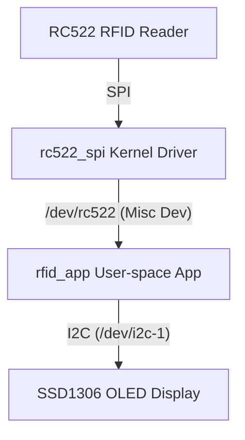

# Raspberry Pi 4 Yocto-based RFID & OLED Access System

This repository showcases an Embedded Linux portfolio project containing a custom **Yocto Project Layer** (`meta-rfid-oled`) and a standalone **Out-of-Tree Linux Kernel Module** paired with a **User-Space C Application** (`rfid_oled_project`) for a Raspberry Pi 4.

The system interfaces with:
- **MFRC522 RFID Reader** via the **SPI0** bus.
- **SSD1306 OLED Display** via the **I2C-1** bus.

---

## 🛠️ Hardware Wiring

| Device | Peripheral Pin | Raspberry Pi 4 Pin | Physical Pin Number |
| :--- | :--- | :--- | :--- |
| **SSD1306 OLED** | VCC | 3.3V | Pin 1 |
| | GND | GND | Pin 9 |
| | SDA | GPIO 2 (SDA) | Pin 3 |
| | SCL | GPIO 3 (SCL) | Pin 5 |
| **RC522 RFID** | VCC | 3.3V | Pin 17 |
| | GND | GND | Pin 25 |
| | MISO | GPIO 9 (MISO) | Pin 21 |
| | MOSI | GPIO 10 (MOSI) | Pin 19 |
| | SCLK | GPIO 11 (SCLK) | Pin 23 |
| | SDA (CS) | GPIO 8 (SPI0_CE0_N) | Pin 24 |

---

## 📂 Repository Structure

- `meta-rfid-oled/`: The custom Yocto Layer.
  - `recipes-kernel/rfid-module/`: Bitbake recipe & source code for the out-of-tree kernel SPI driver (`rc522_spi.c`).
  - `recipes-app/rfid-app/`: Bitbake recipe for the user-space C application (`rfid_app`) and the init startup script (`rfid-setup`).
  - `recipes-bsp/rpi-rfid-overlay/`: Bitbake recipe for the Device Tree Overlay to configure and activate the SPI/RFID DT node.
  - `recipes-core/images/rfid-image.bb`: A custom minimal image recipe inheriting `core-image` that packages the application, driver, and overlays.
- `rfid_oled_project/`: A standalone development workspace containing duplicate sources of the Driver and App for testing outside of Yocto (e.g., cross-compiling or building directly on the target Pi).

---

## ⚙️ Architecture & Data Flow



1. **Device Tree Overlay (`rc522-overlay.dts`)**: Enables SPI0, disables the default `spidev@0` driver, and registers a device node under SPI0 compatible with `"nxp,rc522"`.
2. **Kernel Driver (`rc522_spi.c`)**: Binds to the `"nxp,rc522"` device node. It registers a character device at `/dev/rc522`. When read, it queries the hardware register `0x37` of the RC522 chip to check if the connection is successful and reports back.
3. **User Application (`main.c` / `ssd1306_i2c.c`)**: Initializes the OLED screen via I2C, then polls `/dev/rc522` every 2 seconds. When it reads a successful tag detection log, it updates the OLED screen to display `Tag Detected! Access Granted`.

---

## 🚀 How to Build and Run

### Option A: Building with Yocto Project (Recommended)

To build a fully bootable SD Card image containing the driver, application, and configurations pre-installed:

1. **Set up the Yocto environment** (e.g., clone `poky`, `meta-raspberrypi`).
2. **Add `meta-rfid-oled`** to your build layer configuration:
   ```bash
   bitbake-layers add-layer meta-rfid-oled
   ```
3. **Build the Custom Image**:
   ```bash
   bitbake rfid-image
   ```
4. **Flash the Image** to your SD card using a tool like DD or Balena Etcher.

The image automatically handles module loading (`rc522_spi.ko`), device node binding via the `rfid-setup` init script, and boots directly into the `rfid_app`.

---

### Option B: Standalone Build (Directly on Raspberry Pi or Cross-Compile)

If you are running a standard Raspberry Pi OS and want to build the project manually:

#### 1. Device Tree Configuration
Compile the device tree overlay and move it to the overlays directory:
```bash
cd rfid_oled_project/kernel_module
dtc -@ -I dts -O dtb -o rc522.dtbo rc522-overlay.dts
sudo cp rc522.dtbo /boot/overlays/
```
Enable SPI, I2C, and the overlay in `/boot/config.txt` (or `/boot/firmware/config.txt` on newer OS):
```text
dtparam=spi=on
dtparam=i2c_arm=on
dtoverlay=rc522
```
*Reboot the Pi:* `sudo reboot`

#### 2. Load the Kernel Module
Compile and load the kernel driver:
```bash
cd rfid_oled_project/kernel_module
make
sudo insmod rc522_spi.ko
```
Verify that the device node `/dev/rc522` has been created:
```bash
ls -l /dev/rc522
dmesg | tail
```

#### 3. Compile and Run the App
Compile and run the user application:
```bash
cd rfid_oled_project/user_app
make
sudo ./rfid_app
```
You should see `SYSTEM BOOT OK!` on the OLED screen, and hardware logs printed to the terminal console.
